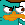

# Hipchat Emoticons

A repository of custom HipChat emoticons used at [Unbounce](http://unbounce.com).

*Note: You can discover all the default, built-in hipchat emoticons at [hipchat-emoticons.nyh.name](http://hipchat-emoticons.nyh.name/)*

## Creating custom emoticons

Custom hipchat emoticons can be uploaded through your Hipchat account by admin users: https://customername.hipchat.com/admin/emoticons

Please also add to the list of emotions when you add new emoticons to the repo.

> Images must be under 100Kb and have max dimensions of 25px-tall and 30px-wide.
>
> Use a transparent PNG for best results.
>
> Animated gifs are reluctantly supported.

List of emoticons
-----------------

*            (unbounce)
*      (honeybadger)
*        (chriscodes)
*      (wordupcorey)
*                  (yolou)
*                    (vivi)
*            (verygary)
*                (cobras)
*                      (wow)
*                    (rats)
*                 (plat)
*              (canucks)
*                    (habs)
